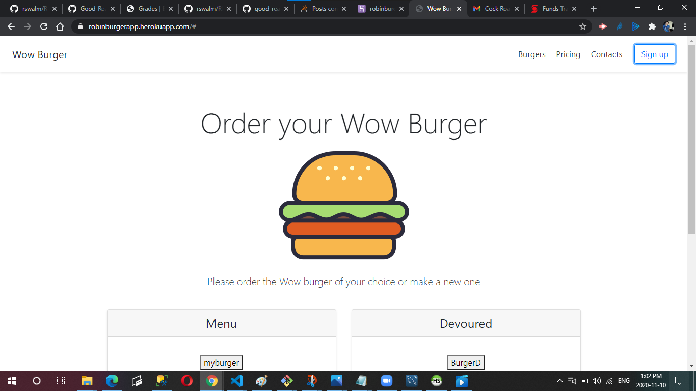
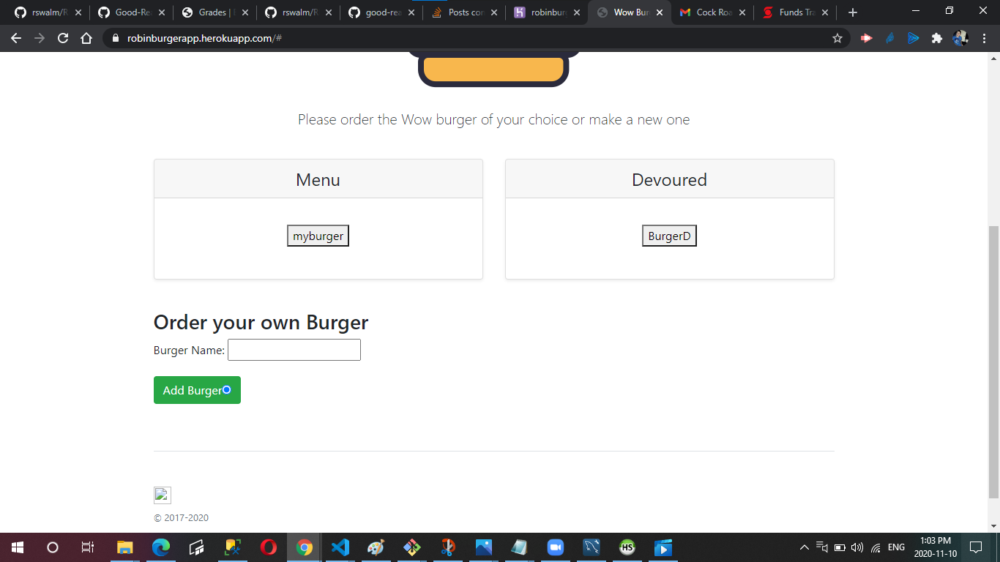
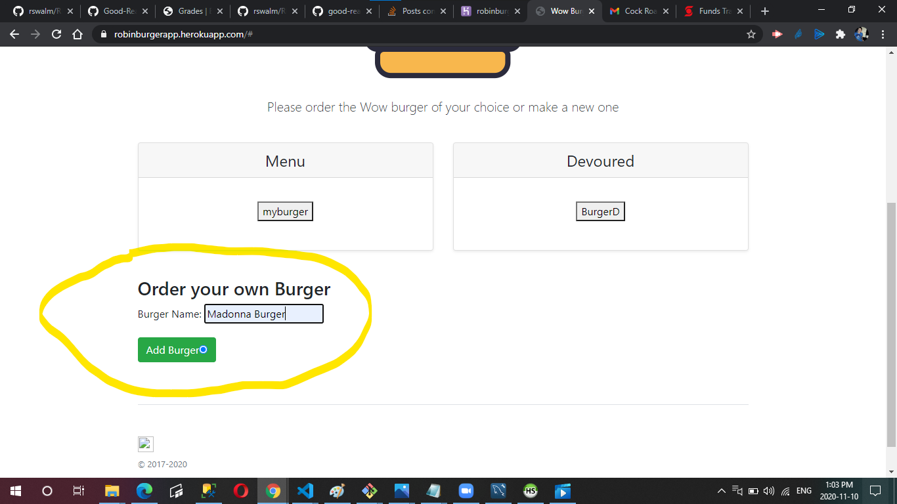
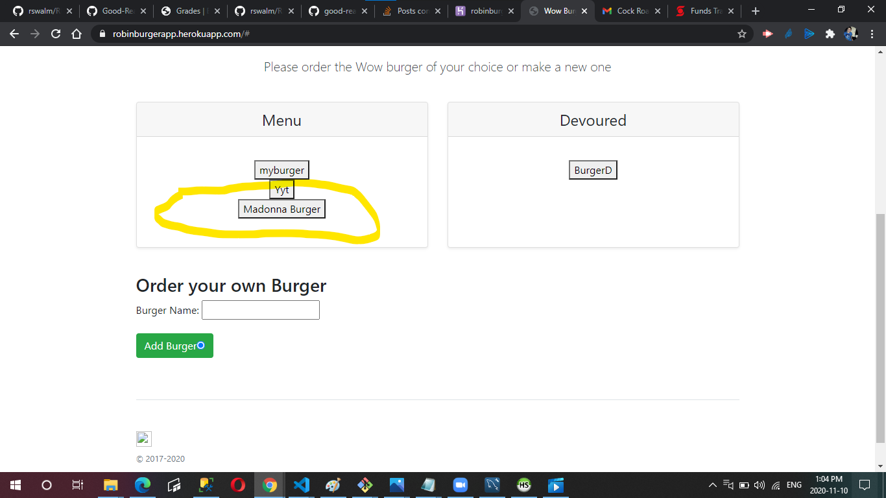
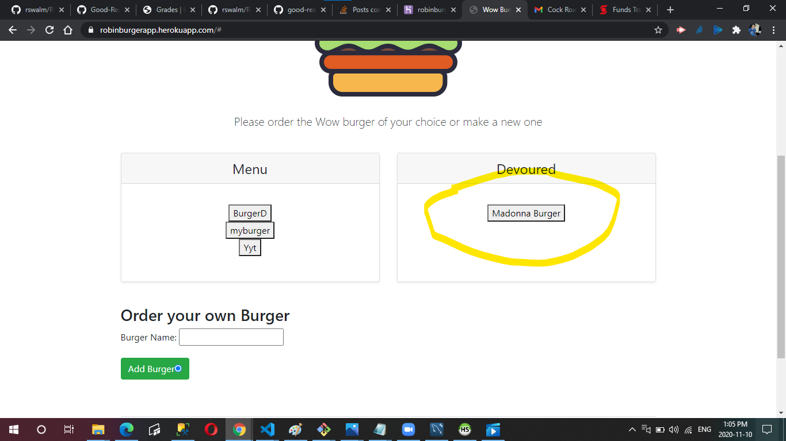

# Burger App

I have created a burger logger with MySQL, Node, Express and Handlebars

Wow burger is a restraunt app that lets users inout the names of burgers they'd like to eat. A Burger can be add by typing the name of a burger in the typing field and by pressing the "add burger" button, the burger is added to the menu(waiting) area. When a burger is clicked, it is then moved to the "devoured" area. This app will store every burger in a database, whether devoured or not.

# Github Repository
### https://github.com/rswalm/RobinBurgerApp

# Deployed Application (Heroku Link)
### https://robinburgerapp.herokuapp.com/